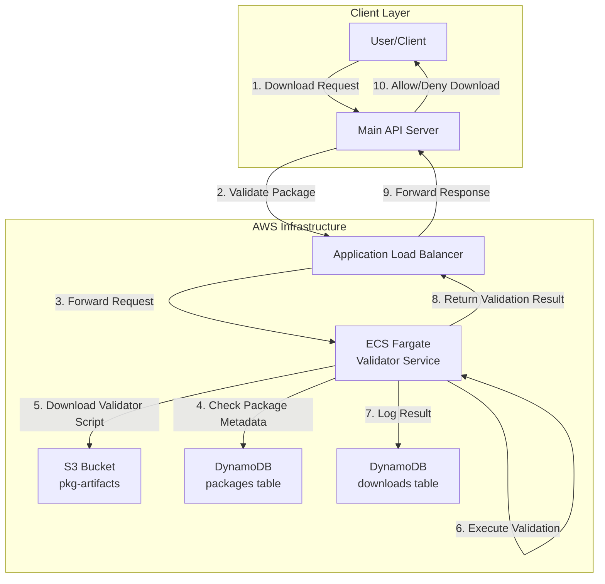
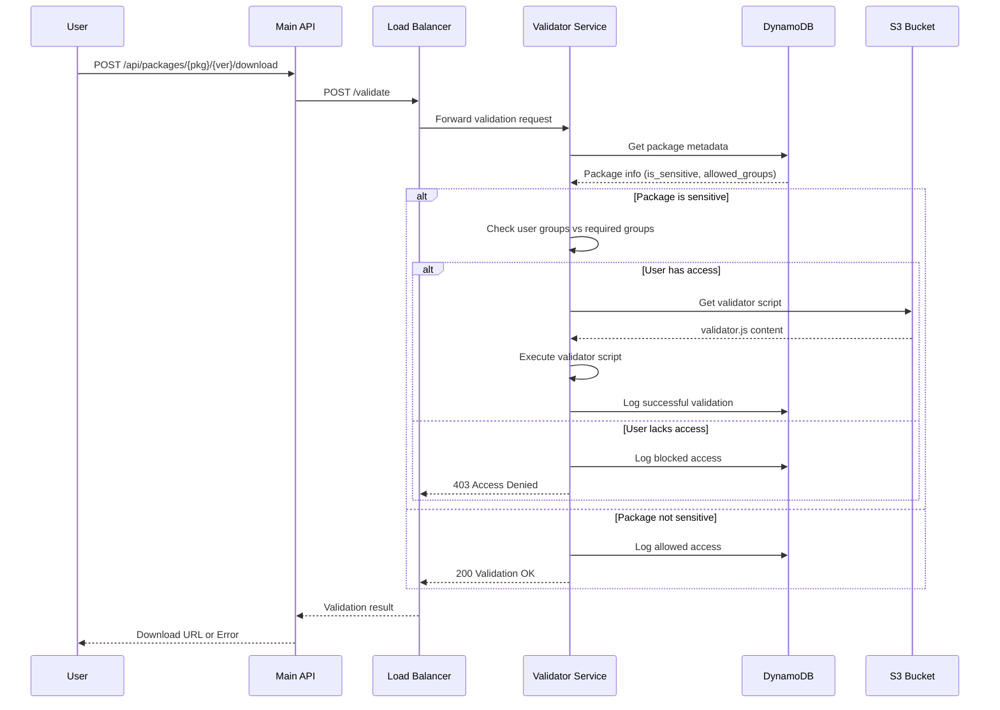
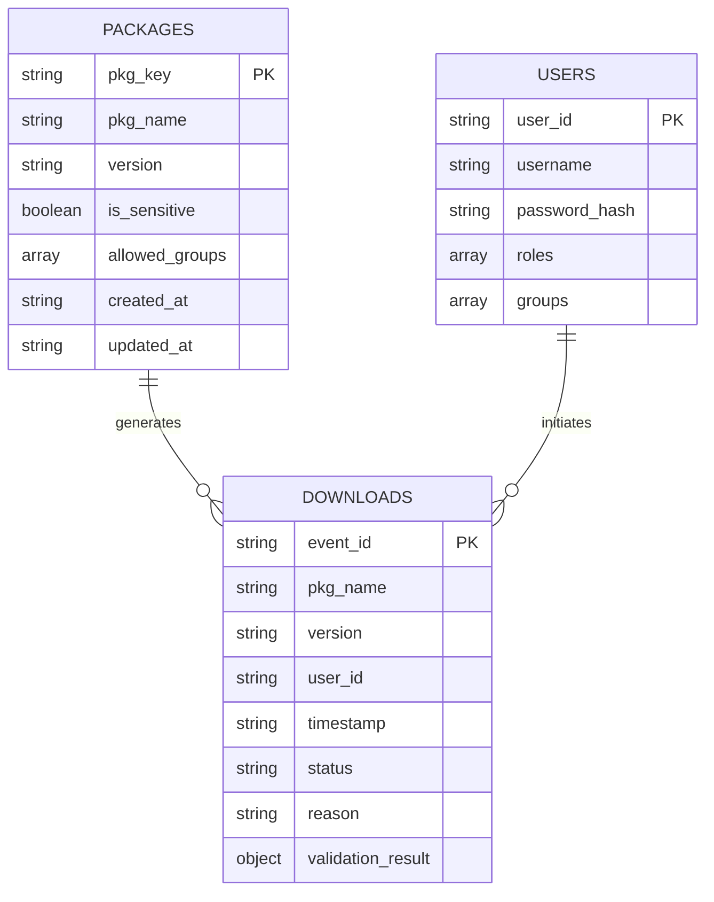
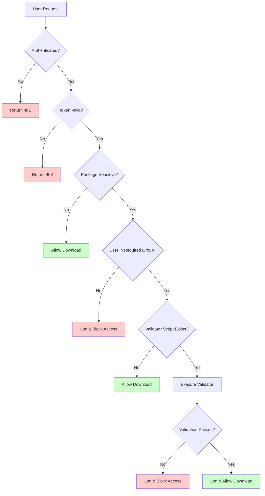
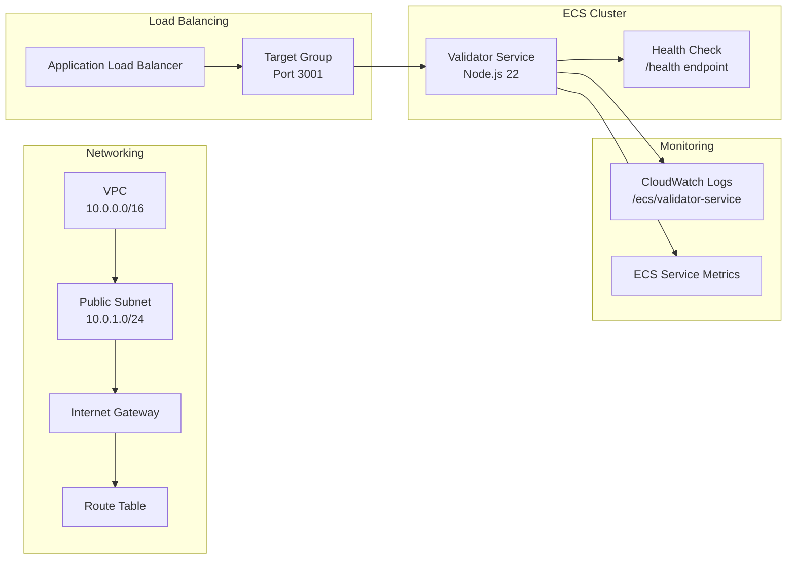
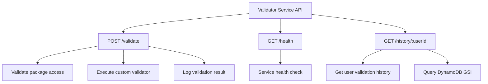
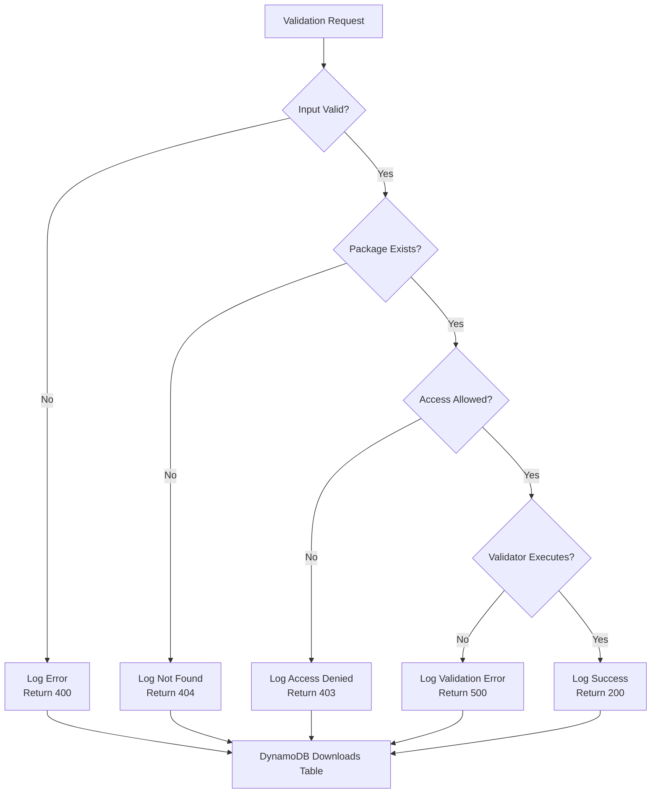

<<<<<<< HEAD
# Validator Service Architecture

## System Overview

## Detailed Validation Flow

## Data Models

## Security & Access Control

## Infrastructure Components

## API Endpoints

## Error Handling & Logging

=======
# Validator Service Architecture

## System Overview

## Detailed Validation Flow

## Data Models

## Security & Access Control

## Infrastructure Components

## API Endpoints

## Error Handling & Logging

>>>>>>> c1c1f250728e8f0eb8736a4331c63be9084b0856
