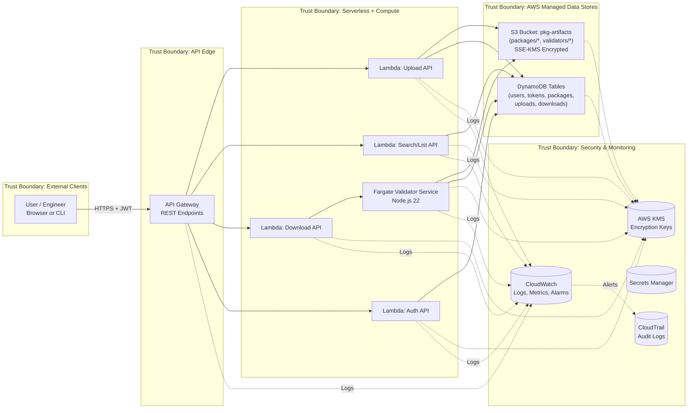

# 🛡️ STRIDE Threat Model

This section presents the **system-level threat model** and mitigations for the **ACME Trustworthy Module Registry**, following the **STRIDE** methodology.  
The model covers all major components — **API Gateway, AWS Lambda, ECS Fargate Validator Service, S3, DynamoDB, KMS, Secrets Manager, CloudWatch, and CloudTrail** — and emphasizes the **Access Control Track**, where sensitive models require validation before download.

---

## ⚙️ System Overview

**Architecture Summary**

User → API Gateway → Lambda (Upload/Search/Auth) → ECS Fargate Validator → S3 (pkg-artifacts) + DynamoDB (metadata)
↳ AWS KMS + Secrets Manager (encryption & key management)
↳ CloudWatch + CloudTrail (monitoring & auditing)

**Trust Boundaries**

1. **External Clients → API Gateway**
2. **API Gateway → Lambda / ECS Compute**
3. **Compute → AWS Managed Data Stores (S3, DynamoDB)**
4. **Compute → Security Services (KMS, Secrets Manager)**
5. **Compute → Monitoring and Logging (CloudWatch, CloudTrail)**

---

## 🧠 STRIDE Threat Analysis (Detailed)

### 🧩 Spoofing Identity

**Threat:**  
An attacker could forge or reuse expired JWT tokens to impersonate a valid user and access protected endpoints such as `/packages/init`, `/validate`, or `/reset`.

**Mitigation:**

- All requests use **JWT authentication** signed with a secret managed by **AWS KMS**.
- Tokens are validated by a dedicated **Auth Lambda**, verified for expiration (10 h or 1,000 uses max).
- **IAM Group_106 policy** isolates user roles; admins must enable **MFA**.
- Each token consumption is logged to **DynamoDB (tokens table)**, preventing replay.

---

### 🧱 Tampering with Data

**Threat:**  
Adversaries might alter package blobs or metadata in transit or at rest — for example, uploading a modified zip or changing the validator script.

**Mitigation:**

- **S3 buckets are private** with **SSE-KMS** encryption and versioning enabled.
- **Presigned URLs** (≤ 300 s TTL) ensure integrity during upload/download.
- **DynamoDB conditional writes** protect metadata consistency (prevent race updates).
- All stored packages include a **SHA-256 hash** computed during upload and re-verified by the validator.

---

### 🧾 Repudiation

**Threat:**  
A user denies having uploaded, validated, or deleted a package after it’s flagged as unsafe.

**Mitigation:**

- **CloudTrail** captures every API call and S3/DynamoDB event with user ARN and timestamp.
- **CloudWatch Logs** store application-level audit entries (uploadId, pkgName, version, userId).
- Logs are immutable, periodically archived to **S3 Glacier**, providing non-repudiation evidence.

---

### 🔒 Information Disclosure

**Threat:**  
Unauthorized access to private packages, validator scripts, or sensitive user data (e.g., token or role metadata).

**Mitigation:**

- **S3 pkg-artifacts** bucket enforces **least-privilege IAM roles**; only specific Lambdas/ECS tasks can access objects.
- **Presigned URLs** are short-lived and HTTPS-only.
- **Sensitive fields** (password hashes, secrets) are encrypted via **KMS** or stored in **Secrets Manager**.
- **Validator Service** performs RBAC checks against user groups before download.
- Regular AWS Config and CloudTrail reviews detect policy drift or data leaks.

---

### 🧨 Denial of Service (DoS)

**Threat:**  
Attackers could flood upload/download endpoints or send repeated validation requests to exhaust Lambda/ECS resources.

**Mitigation:**

- **API Gateway throttling** limits per-user request rate.
- **AWS WAF** blocks common DoS patterns and large payloads.
- **Lambda concurrency limits** and **ECS autoscaling policies** prevent cascading failures.
- **CloudWatch alarms** trigger when p95 latency or 5xx rate exceeds thresholds, allowing auto-rollback or scale-out.
- **Terraform** can redeploy a clean environment rapidly if a DoS attack corrupts state.

---

### 🧍‍♂️ Elevation of Privilege

**Threat:**  
A standard user escalates privileges to “admin” or modifies IAM policies to gain wider access.

**Mitigation:**

- **Group_106** users restricted to project-specific S3/DynamoDB permissions only.
- **Admin users** reside in a separate IAM group with **AdministratorAccess** and MFA.
- **Validator Lambda roles** use least-privilege execution; they cannot mutate policies or deploy code.
- Terraform state files are protected by S3 bucket policies and role assumptions via **GitHub OIDC** — no hard-coded credentials.

---

## 🧩 Validator Service — Sub-Threat Analysis

The **ECS Fargate Validator Service** executes user-uploaded JavaScript validators in a sandbox when downloading _sensitive packages_.

| **Threat**                                           | **Risk** | **Mitigation**                                                                                                                          |
| ---------------------------------------------------- | -------- | --------------------------------------------------------------------------------------------------------------------------------------- |
| Malicious validator code executes arbitrary commands | High     | **Fargate task role** grants minimal S3/DynamoDB access; validator runs under **Node v22 sandbox** with resource limits (CPU + memory). |
| Compromised validator leaks environment secrets      | Medium   | Environment variables contain no plaintext keys; **AWS KMS** encrypts values at rest; secrets mounted read-only.                        |
| Denial of Service via infinite loop                  | Medium   | ECS task timeout + memory limit enforced (Stop Task after 5 s).                                                                         |
| Tampering with validation logs                       | Low      | Validation results stored in **DynamoDB (downloads table)** with conditional writes and **CloudTrail auditing**.                        |

---

## 🧩 Defense-in-Depth Summary

- **Authentication:** JWT + KMS validation
- **Authorization:** IAM RBAC + group-based access control
- **Integrity:** S3/DynamoDB encryption + hash verification
- **Confidentiality:** Private buckets, Secrets Manager, HTTPS transport
- **Availability:** Autoscaling, WAF, API Gateway throttling
- **Auditability:** CloudTrail, CloudWatch, immutable logs

Together, these controls mitigate threats across every STRIDE dimension and provide a complete **security case** for the ACME Registry’s cloud-first design.

---

## 🔐 Security DFD (Trust Boundaries)

### 🧭 Trust Boundary Explained

Each trust boundary in the diagram was derived from transitions where **data, privileges, or security assumptions change** inside the AWS architecture.

- **TB1 – External Clients → API Gateway:** separates untrusted public users from the trusted AWS entry point.
- **TB2 – API Gateway → Lambda / ECS:** marks a change in execution context and IAM role ownership.
- **TB3 – Compute → Data Stores (S3, DynamoDB):** separates short-lived compute from persistent encrypted storage.
- **TB4 – Compute → Security Services (KMS, Secrets Manager):** isolates cryptographic and secret-management operations from app logic.
- **TB5 – Monitoring & Auditing (CloudWatch, CloudTrail):** segregates operational visibility and logging from functional workloads.

These boundaries correspond to where **STRIDE categories** emerge in the system:

- **Spoofing/Tampering** risks occur across TB1 and TB2.
- **Information Disclosure** and **Tampering** dominate TB3.
- **Elevation of Privilege** is mitigated at TB4 through IAM least-privilege and KMS scoping.
- **Repudiation** threats are handled at TB5 via CloudTrail’s immutable logs.
